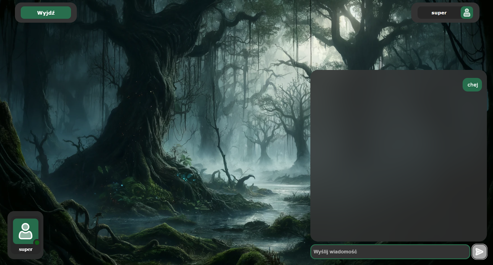

# SETTING UP PROJECT


## Used technologies

- React
- Spring Boot
- Websockets (STOMP)
- Docker
- PostgreSQL
- JWT
- JPA
- Lombok
- MapStruct

## Requirements

- Docker (https://docs.docker.com/get-docker/)
- Node.js (https://nodejs.org/en/download/) v20.14.0
- NPM (https://www.npmjs.com/get-npm) v10.7.0
- Java 11 (https://www.oracle.com/java/technologies/javase-jdk11-downloads.html) - only for development

## Set up .env file
Create a .env file in the root directory of the project and add the variables from the `.env.example` file.

## Install dependencies

fist go to `frontend` directory and run the following command:

```bash
npm install
```

## Run the project

To run the project, you need to run the following command in the root directory of the project:

```bash
docker-compose up
```

At the `frontend` directory, run the following command:

```bash
npm start
```

## IF you run into problem `./gradlew: not found`

Go to the backend directory and change end of line sequence to LF

# Project ttrpg


The project includes a ttrpg site that allows live chat rooms, public as well as private

## Funkcjonalności

- User registration and login


- Creating rooms


- Chat in the room



- room invitation link


- editing and deleting user-created rooms

- user panel with the ability to edit data and having visibility of our created rooms


### Admin

- banning and unbanning users and editing their data without a password


- editing and deleting rooms created by each user